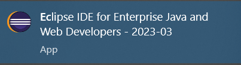
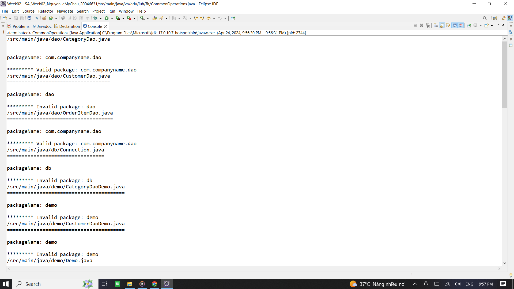
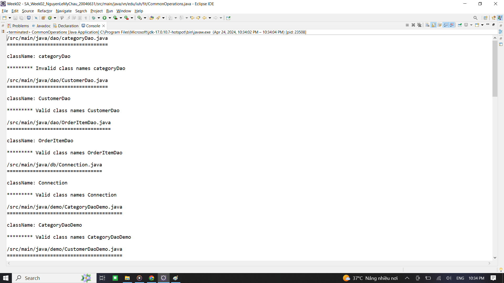
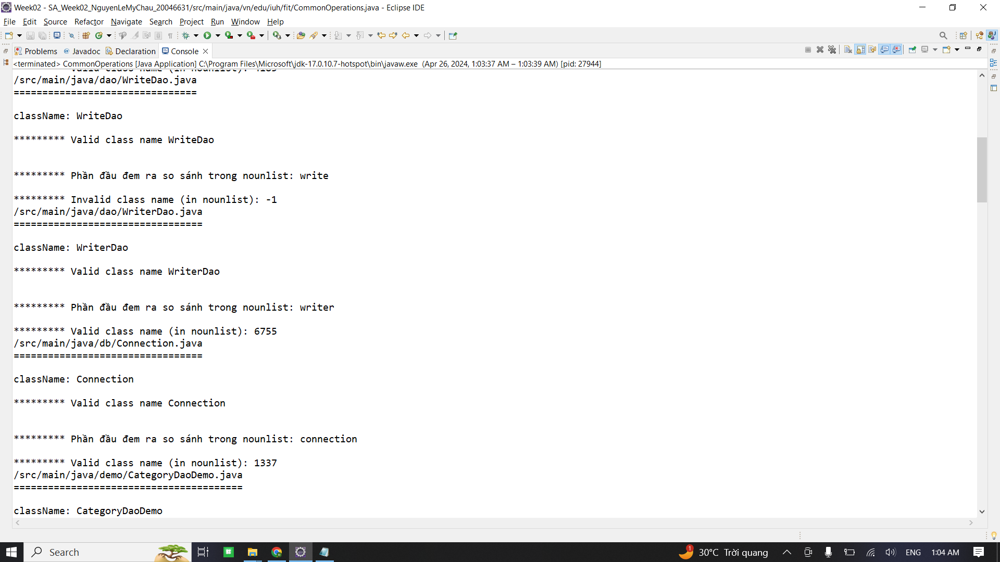
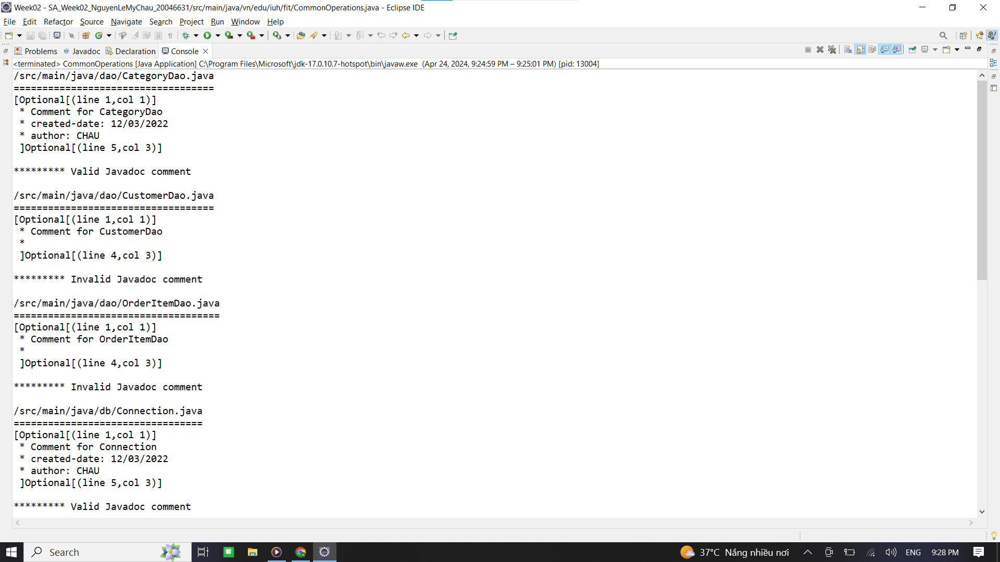
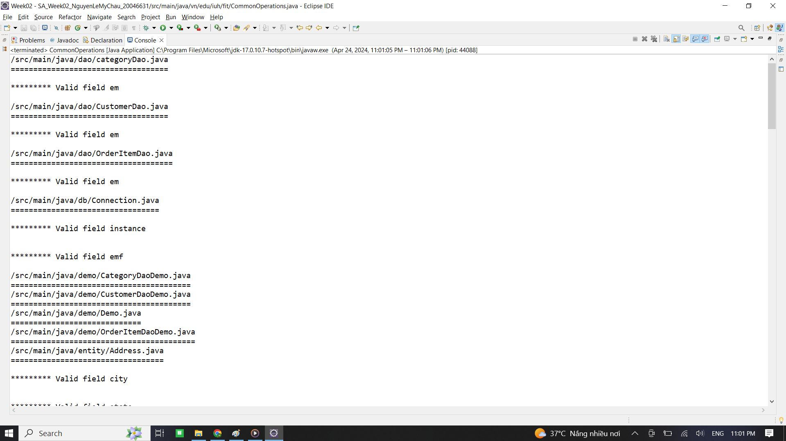
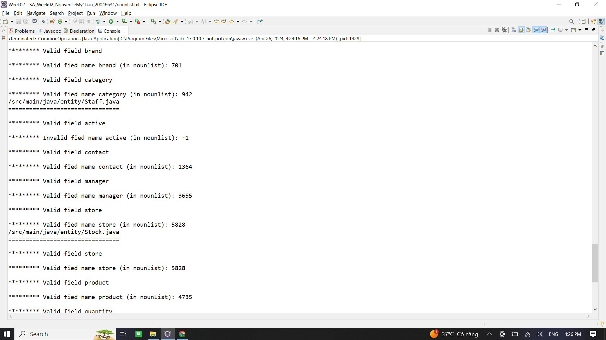
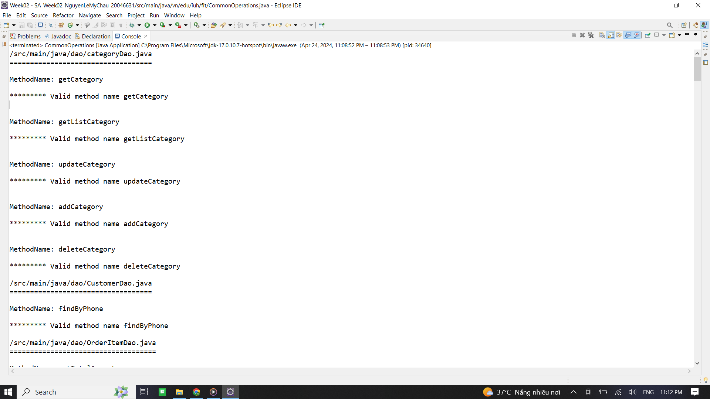
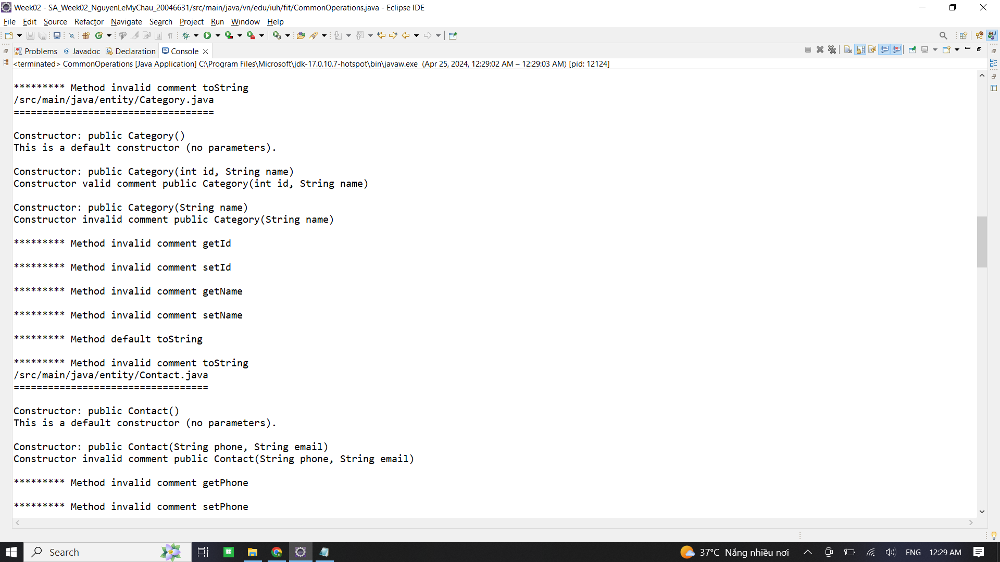

# SA_Week02_NguyenLeMyChau_20046631

#### Mô tả
Việc tổ chức viết code phải tuân theo quy định chặt chẽ về tổ chức và cấu trúc. Các nguyên lý được thực hiện như sau.

#### Sử dụng
- JDK: Phiên bản 17.0.10
- Nguồn lấy nounlist: <https://www.desiquintans.com/nounlist>
- Nguồn lấy verbs: <https://github.com/aaronbassett/Pass-phrase/blob/master/verbs.txt>

#### Công cụ
)

#### Code trong class CommonOperations

##### Câu 1. Các package trong dự án phải theo mẫu: com.companyname.* (*:tên bất kỳ)

 )

##### Câu 2. Các class phải có tên là một danh từ hoặc cụm danh ngữ và phải bắt đầu bằng chữ hoa.

Hình 1. Check điều kiện bắt đầu bằng chữ hoa 

Hình 2. Check điều kiện danh từ
Sử dụng file nounlist.txt (gồm 6108 danh từ) --> Đem từ đầu tiên trước chữ cái viết hoa thứ 2 làm partName để so sánh trong nounlist --> Tồn tại thì trả về vị trí từ đó trong nounlist, ngược lại trả về -1

##### Câu 3. Mỗi lớp phải có một comment mô tả cho lớp. Trong comment đó phải có ngày tạo
(created-date) và author.

Trong comment **có** created-date và author -> In ra Valid Javadoc comment

Trong comment **không có** created-date và author -> In ra Invalid Javadoc comment

 )

##### Câu 4. Các fields trong các class phải là danh từ hoặc cụm danh ngữ và phải bắt đầu bằng một chữ thường.

Hình 1. Check điều kiện chữ thường

Hình 2. Sử dụng file nounlist.txt (gồm 6108 danh từ) --> Đem field so sánh trong nounlist --> Tồn tại thì trả về vị trí từ đó trong nounlist, ngược lại trả về -1

##### Câu 5. Tất cả các hằng số phải là chữ viết hoa và phải nằm trong một interface.

##### Câu 6. Tên method phải bắt đầu bằng một động từ và phải là chữ thường

Hình 1. Check điều kiện là chữ thường
)

Hình 2. Check điều kiện động từ
Sử dụng file verbs.txt (gồm 1043 động từ) --> Đem từ đầu tiên trước chữ cái viết hoa thứ 2 làm partName để so sánh trong verbs --> Tồn tại thì trả về vị trí từ đó trong verbs, ngược lại trả về -1

##### Câu 7. Mỗi method phải có một ghi chú mô tả cho công việc của method trừ phương thức default constructor, hashCode, equals, toString.

--> Check Method 
--> Nếu method thuộc các trường hợp hashCode, equals, toString --> In ra Method default
--> Ngược lại thì sẽ check các method đó có comment không, nếu có thì Method valid comment, còn không thì Method invalid comment

--> Check constructor
--> Nếu constructor không có parameter thì default constructor
--> Ngược lại thì check constructor có parameter đó có comment không, nếu có thì Constructor valid comment, còn không thì Constructor invalid comment

 )
